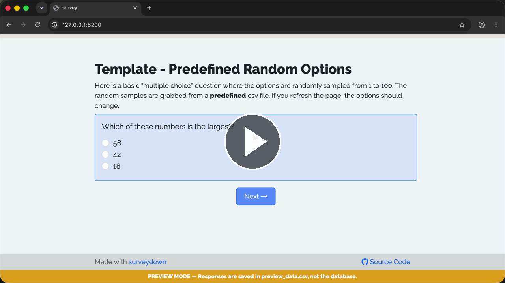

# Template - Random Options Predefined

A template for creating predefined randomized survey options.

### See it in action

Watch the **Walkthrough recording:**

[](https://cdn.jsdelivr.net/gh/surveydown-dev/template_random_options_predefined@main/video-recording.mp4)

### Create this template

Run this command in your R console:

```r
surveydown::sd_create_survey(
  #path = "path/to/survey",
  template = "random_options_predefined"
)
```

### Learn more

- [Template page - Random Options Predefined](https://surveydown.org/templates/random_options_predefined)
- [Document page - Predefined randomization](https://surveydown.org/docs/randomization.html#predefined-randomization)
- [Document page - Start with a template](https://surveydown.org/docs/getting-started#start-with-a-template)
